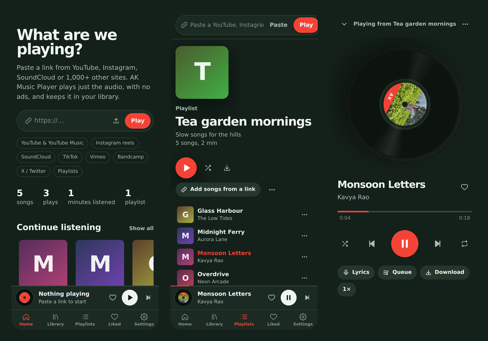

<p align="center"></p>

# AK Music Player

Paste any link from YouTube, Instagram, SoundCloud, TikTok and 1,000+ other sites, and play just the music. No ads, no account, no subscription. Build playlists, read synced lyrics, and download songs as MP3.

Everything runs on your phone. Install the app and start playing: no computer and no extra apps needed.

[](https://github.com/AK30072002/ak-music-player/releases/latest)  

**[⬇ Download for Android](https://github.com/AK30072002/ak-music-player/releases/latest)**

<p align="center"></p>

## Download and install

1. On your phone, open the [latest release](https://github.com/AK30072002/ak-music-player/releases/latest).
2. Under **Assets**, download one file:

   | File | Which phones |
   |---|---|
   | `AK-Music-Player-64-bit.apk` | **Almost every phone** (recommended) |
   | `AK-Music-Player-32-bit.apk` | Older or budget "Android Go" phones, only if the 64-bit one says **App not installed** |

3. Open the file. If Android asks, allow your browser to **Install unknown apps**, then tap **Install**.
4. If Google Play Protect says the app is unknown, tap **More details → Install anyway**. This appears because the app isn't on the Play Store; it only happens once.
5. Open **AK Music Player**. The first start takes 10–20 seconds while the app unpacks its music engine; after that it opens quickly.

**Requirements:** Android 8.0 or newer, about 150 MB of free space, and an internet connection to play new songs. Songs you've played before are saved on the phone.

**To update:** download the new APK and install it over the old one. Your library, playlists and likes stay.

## How to use it

- **Play a link:** copy a link in YouTube, Instagram or any other app, then paste it into the bar at the top and tap **Play**.
- **Share to the app:** in YouTube or Instagram tap **Share → AK Music Player**. It starts playing straight away.
- **Playlists:** tap **⋯** on any song → **Add to playlist**. Paste a YouTube or SoundCloud *playlist* link to import the whole thing.
- **Download:** tap **⋯** → **Download** and choose MP3, M4A or FLAC. Files go to **Downloads/AK Music Player**.
- **Instagram posts that won't play:** open **Settings → Accounts** and sign in to Instagram once. Your login stays on your phone.

## Features

| Area | What you can do |
|---|---|
| **Play from links** | YouTube, YouTube Music, Instagram reels, SoundCloud, TikTok, Vimeo, Bandcamp, Facebook, X and 1,000+ more |
| **Share to play** | Share a link from any app straight to AK Music Player |
| **Playlists** | Create, rename, pin, duplicate, reorder; import whole YouTube and SoundCloud playlists |
| **Player** | Shuffle, repeat one / all, crossfade (0–12 s), speed 0.5×–2×, sleep timer with fade-out |
| **Sound** | 5-band equalizer with presets (Bass boost, Vocal, Electronic, Late night, Podcast…) and volume levelling (turn on **Settings → Audio effects**) |
| **Lyrics** | Synced, scrolling lyrics; tap a line to jump to it |
| **Background play** | Keeps playing with the screen off, with controls in the notification, on the lock screen and on Bluetooth headphones |
| **Library** | Every song you play is saved with artwork; search, sort, filter by site; Liked songs, history, "Continue listening", "On repeat" |
| **Downloads** | MP3 (320 kbps), M4A, FLAC or original, with title, artist and cover art; whole playlists as a zip |
| **Your own files** | Add songs that are already on your phone |
| **Backup** | Save your library and playlists to a file and restore them on another phone |
| **Always up to date** | The app updates its downloader by itself once a day, so it keeps working when sites change |
| **Looks** | Dark and light themes, spinning-record player with a live visualizer |

## Troubleshooting

**A link says "needs you to be signed in"**
Go to **Settings → Accounts** and sign in to that site (Instagram, Facebook or X), then try the link again.

**A YouTube or Instagram link stopped working**
Sites change often. The app updates its downloader by itself once a day: close the app completely (swipe it away), wait a minute, and open it again. If it still fails, install the newest APK from the releases page.

**Music stops when the screen is off**
Android Settings → Apps → AK Music Player → Battery → **Unrestricted**. Some phones (Xiaomi, Oppo, Vivo, Realme, Samsung) need this.

**"The music engine couldn't start"**
Tap **Try again**. If it keeps happening, make sure the phone has at least 150 MB free, then reinstall the app.

**"App not installed"**
You may need the 32-bit APK (see the table above). If you installed an older build signed with a different key, uninstall it first.

## Build the app

You don't need Android Studio. GitHub builds the APK for you:

1. Every push to `main` builds both APKs automatically. Open the **Actions** tab, click the latest run, and download them under **Artifacts** (unzip to get the .apk).
2. To publish a release with the APKs attached, push a version tag:
   ```
   git tag v1.0.0
   git push origin v1.0.0
   ```
   About 10–15 minutes later the APKs appear on the **Releases** page.

To build on your own computer instead: install Android Studio and Python 3.13, run the "Download FFmpeg and QuickJS" commands from `.github/workflows/build-apk.yml`, then open the `android` folder and choose **Build → Build APK(s)**.

**Signing:** the repository includes `android/app/ak-release.jks` so every build is signed with the same key and updates install over older versions. Because the repository is public, anyone could sign an app with that key. For extra safety, create your own key and add repository secrets `KEYSTORE_BASE64` (the .jks file, base64-encoded), `KEYSTORE_PASSWORD`, `KEY_ALIAS` and `KEY_PASSWORD`; the build then uses yours. (Phones with the old version need to uninstall it once after you switch keys.)

## Use it on a computer too (optional)

The same player runs in a browser on Windows, macOS or Linux. Install Python, [FFmpeg](https://ffmpeg.org/download.html) and [Deno](https://deno.com) or Node.js, then double-click `run.bat` (Windows) or run `./run.sh` (macOS/Linux) and open http://localhost:8000. With Docker: `docker compose up -d --build`.

## How it works

```
android/   the app: Java (no extra libraries) — player screen, notification controls, downloads, sign-in
  └─ python/akserver.py   starts the built-in music engine inside the app
backend/   the music engine: Python, FastAPI, yt-dlp, SQLite
frontend/  the player interface: HTML, CSS, JavaScript
```

Inside the APK, [Chaquopy](https://chaquo.com/chaquopy/) runs Python, which serves the player on the phone itself (127.0.0.1). [yt-dlp](https://github.com/yt-dlp/yt-dlp) fetches just the audio, [FFmpeg](https://ffmpeg.org) converts downloads, and [QuickJS](https://github.com/quickjs-ng/quickjs) solves YouTube's playback checks. Your library is stored only on your phone.

## Fair use

AK Music Player is a personal tool. Only download what you have the right to save, and respect each site's terms and the artists whose music you enjoy.

## Credits

Made by **AJAIKRISHNA**. © 2026 AJAIKRISHNA. All rights reserved.

Built with [Chaquopy](https://chaquo.com/chaquopy/) (MIT), [yt-dlp](https://github.com/yt-dlp/yt-dlp) (Unlicense), [FFmpeg](https://ffmpeg.org) static builds by John Van Sickle via [ffmpeg-static](https://github.com/eugeneware/ffmpeg-static) (GPL), [QuickJS-ng](https://github.com/quickjs-ng/quickjs) (MIT), [FastAPI](https://fastapi.tiangolo.com) (MIT), and lyrics from [LRCLIB](https://lrclib.net). Notification icons from Google's Material Icons (Apache 2.0).
